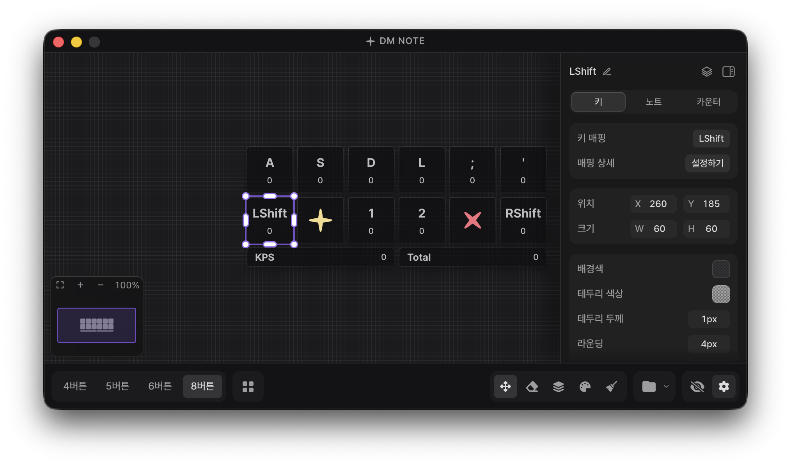

**한국어** | [English](docs/readme_en.md) | [中文](docs/readme_zh-cn.md)

<div align="center">
  

  <h1>DM Note</h1>

  <p>
    <strong>Make it yours</strong>
  </p>
  <p>
    <strong>나만의 스타일로 완성하는 키뷰어</strong>
  </p>

  [](https://github.com/DmNote-App/DmNote/releases)
  [](https://github.com/DmNote-App/DmNote/releases/download/2.0.2/DM.NOTE.v.2.0.2.zip)
  [](https://github.com/DmNote-App/DmNote/blob/main/LICENSE)
</div>

<div align="center">
  
</div>

## 개요

**DM Note**는 DJMAX RESPECT V에서 사용하기 위해 만들어진 키뷰어입니다.

다른 게임에서도 자유롭게 사용할 수 있고 설정이 간단해서 스트리밍이나 플레이 영상에 키 입력을 바로 띄울 수 있습니다.

**지원 환경** · Windows 10/11 · macOS
리눅스 환경이라면 [커뮤니티 포크 버전](https://github.com/northernorca/DmNote)을 사용해 보시는 것을 추천합니다.

[DM NOTE v2.0.2 다운로드](https://github.com/DmNote-App/DmNote/releases/download/2.0.2/DM.NOTE.v.2.0.2.zip)

[Code signing policy](CODE_SIGNING_POLICY.md)

## 주요 기능

**입력과 표시**: [실시간 시각화](https://dmnote.app/docs/guide/interface) · [키 매핑](https://dmnote.app/docs/guide/key-mapping) · [노트 효과](https://dmnote.app/docs/guide/note-effects) · [키 카운터](https://dmnote.app/docs/guide/key-counter) · KPS 통계와 그래프 · 키음

**꾸미기**: 그리드에서 키 편집 · 키마다 이미지 지정 · [사용자 정의 CSS](https://dmnote.app/docs/custom-css) · 플러그인 · [프리셋](https://dmnote.app/docs/guide/presets)

**오버레이**: 항상 위에 표시 · 위치 고정 · 리사이즈 기준점 · OBS 브라우저 소스

그 밖에 다국어 5종, 단축키, 설정 초기화, 자동 업데이트를 지원합니다. 자세한 사용법은 [문서](https://dmnote.app/docs/)를 확인해 주세요.

## 설치

위 다운로드 링크에서 최신 버전을 받아 압축을 풀고 실행하면 바로 사용할 수 있습니다.

macOS는 별도 권한 설정이 필요합니다. [macOS 설치 및 권한 설정 가이드](docs/mac_guide.md)를 먼저 확인해 주세요.

설정은 `%appdata%/com.dmnote.desktop` 폴더에 저장됩니다.

> 스트리밍이나 플레이 영상 제작에 자유롭게 사용하셔도 됩니다.

## 사용 팁

> [!TIP]
> 오버레이를 직접 볼 필요 없이 스트리밍이나 녹화에만 사용한다면 **OBS 모드**를 권장합니다.
>
> 일반 오버레이 모드보다 게임 프레임에 주는 부담이 적습니다.

게임용 컴퓨터와 스트리밍/녹화용 컴퓨터가 따로 있다면 게임용 컴퓨터에서 DM Note를 실행하고 스트리밍/녹화용 컴퓨터에서 OBS 브라우저 소스로 연결하는 방법을 추천합니다.

키뷰어 때문에 생기는 게임 프레임 저하를 거의 없앨 수 있습니다.

### 오버레이가 게임에 가려질 때

**항상 위에 표시**를 켜도 일부 게임은 전체화면에서 오버레이를 덮습니다. 이때는 테두리 없는 창 모드를 사용해 주세요.

## 플러그인과 CSS

> [!WARNING]
> **신뢰할 수 없는 플러그인은 절대 불러오지 마세요.**
>
> 비공식 플러그인을 사용할 때는 ChatGPT 같은 도구로 안전한지 반드시 확인한 뒤 사용해 주세요.

사용자 정의 CSS로 프로그램 인터페이스와 오버레이 스타일을 원하는 대로 바꿀 수 있습니다.

공식 플러그인과 CSS 예제는 `assets.zip`에 들어 있습니다.

클래스명은 선택자 없이 이름만 입력해 주세요. (`blue` ✅, `.blue` ❌)

## 개발

### 기술 스택

- **프론트엔드**: React 19 + TypeScript + Vite 7
- **백엔드**: Tauri
- **스타일링**: Tailwind CSS 3
- **입력 감지**: Raw Input API (Windows), 전역 입력 이벤트 (macOS)
- **패키지 매니저**: npm

### 설치와 실행

터미널에서 다음 명령어를 순서대로 입력해 주세요.

```bash
git clone https://github.com/DmNote-App/DmNote.git
cd DmNote
npm install
npm run tauri:dev
```

<details>
<summary><b>Windows ASIO 빌드</b></summary>

Windows에서는 `npm run tauri:dev` / `npm run tauri:build`에 키음 ASIO 출력이 기본으로 포함됩니다 (npm 스크립트가 `asio-backend` 피처를 활성화합니다).

ASIO 빌드에는 일반 종속성 외에 다음이 필요합니다.

- **LLVM/Clang**: ASIO 헤더 바인딩 생성(bindgen)에 사용됩니다. LLVM을 설치하고(`winget install LLVM.LLVM` 또는 `scoop install llvm`) 환경 변수 `LIBCLANG_PATH`를 LLVM의 `bin` 폴더 경로로 설정해 주세요.
- **ASIO SDK**: Steinberg ASIO SDK가 저장소에 포함되어 있어(`src-tauri/vendor/asio-sdk`) 자동으로 사용됩니다. 별도 설정이나 네트워크 연결은 필요 없고 다른 SDK를 사용하려면 `CPAL_ASIO_DIR` 환경 변수로 바꾸시면 됩니다.

ASIO 없이 빌드하려면(LLVM 불필요, 기여할 때 편합니다) `npm run tauri:dev:no-asio` / `npm run tauri:build:no-asio`를 사용해 주세요. `src-tauri`에서 직접 실행하는 `cargo check` / `cargo build`도 기본은 ASIO를 포함하지 않으며 ASIO 코드 경로까지 검사하려면 `--features asio-backend`를 붙여 주세요.

> 이 저장소는 Steinberg ASIO SDK를 듀얼 라이선스 중 GPLv3 옵션으로 사용합니다. 자세한 내용은 [THIRD_PARTY_NOTICES.txt](THIRD_PARTY_NOTICES.txt)를 참고해 주세요. _ASIO is a trademark of Steinberg Media Technologies GmbH, registered in Europe and other countries._

</details>

## 기여하기

기여는 언제나 환영합니다. 자세한 내용은 [기여 가이드](CONTRIBUTING.md)를 확인해 주세요.

### 기여자

<!-- ALL-CONTRIBUTORS-LIST:START - Do not remove or modify this section -->
<!-- prettier-ignore-start -->
<!-- markdownlint-disable -->
<table>
  <tbody>
    <tr>
      <td align="center" valign="top" width="14.28%"><a href="https://github.com/lee-sihun"><br /><sub><b>이시훈</b></sub></a><br />&nbsp;<a href="#maintenance-lee-sihun" title="Maintenance">🚧</a>&nbsp;<a href="https://github.com/DmNote-App/DmNote/commits?author=lee-sihun" title="Code">💻</a>&nbsp;<a href="#ideas-lee-sihun" title="Ideas, Planning, & Feedback">🤔</a>&nbsp;</td>
      <td align="center" valign="top" width="14.28%"><a href="https://github.com/eun-yeon"><br /><sub><b>연우</b></sub></a><br />&nbsp;<a href="#maintenance-eun-yeon" title="Maintenance">🚧</a>&nbsp;<a href="#design-eun-yeon" title="Design">🎨</a>&nbsp;<a href="#ideas-eun-yeon" title="Ideas, Planning, & Feedback">🤔</a>&nbsp;</td>
      <td align="center" valign="top" width="14.28%"><a href="https://github.com/mohong2"><br /><sub><b>mo_hong</b></sub></a><br />&nbsp;&nbsp;&nbsp;&nbsp;&nbsp;&nbsp;&nbsp;<a href="#translation-mohong2" title="Translation">🌍</a>&nbsp;&nbsp;&nbsp;&nbsp;&nbsp;&nbsp;&nbsp;</td>
      <td align="center" valign="top" width="14.28%"><a href="https://github.com/LSVoiid"><br /><sub><b>LSVoiid</b></sub></a><br />&nbsp;&nbsp;&nbsp;&nbsp;<a href="#translation-LSVoiid" title="Translation">🌍</a>&nbsp;<a href="https://github.com/DmNote-App/DmNote/commits?author=LSVoiid" title="Documentation">📖</a>&nbsp;&nbsp;&nbsp;&nbsp;</td>
      <td align="center" valign="top" width="14.28%"><a href="https://github.com/kahyou22"><br /><sub><b>문주</b></sub></a><br />&nbsp;&nbsp;&nbsp;&nbsp;&nbsp;&nbsp;&nbsp;<a href="https://github.com/DmNote-App/DmNote/commits?author=kahyou22" title="Code">💻</a>&nbsp;&nbsp;&nbsp;&nbsp;&nbsp;&nbsp;&nbsp;</td>
      <td align="center" valign="top" width="14.28%"><a href="https://github.com/dustingusius"><br /><sub><b>dustingusius</b></sub></a><br />&nbsp;&nbsp;&nbsp;&nbsp;&nbsp;&nbsp;&nbsp;<a href="#translation-dustingusius" title="Translation">🌍</a>&nbsp;&nbsp;&nbsp;&nbsp;&nbsp;&nbsp;&nbsp;</td>
      <td align="center" valign="top" width="14.28%"><a href="https://github.com/dotoritos-kim"><br /><sub><b>Dotoritos</b></sub></a><br />&nbsp;&nbsp;&nbsp;&nbsp;&nbsp;&nbsp;&nbsp;<a href="https://github.com/DmNote-App/DmNote/commits?author=dotoritos-kim" title="Code">💻</a>&nbsp;&nbsp;&nbsp;&nbsp;&nbsp;&nbsp;&nbsp;</td>
    </tr>
    <tr>
      <td align="center" valign="top" width="14.28%"><a href="https://github.com/KGH1113"><br /><sub><b>KGH1113</b></sub></a><br />&nbsp;&nbsp;&nbsp;&nbsp;&nbsp;&nbsp;&nbsp;<a href="https://github.com/DmNote-App/DmNote/commits?author=KGH1113" title="Code">💻</a>&nbsp;&nbsp;&nbsp;&nbsp;&nbsp;&nbsp;&nbsp;</td>
    </tr>
  </tbody>
</table>

<!-- markdownlint-restore -->
<!-- prettier-ignore-end -->

<!-- ALL-CONTRIBUTORS-LIST:END -->

## 라이선스

[GPL-3.0 License Copyright (C) 2024 DM NOTE](https://github.com/DmNote-App/DmNote/blob/main/LICENSE)

## Special Thanks

- [tauri-apps/tauri](https://github.com/tauri-apps/tauri)
