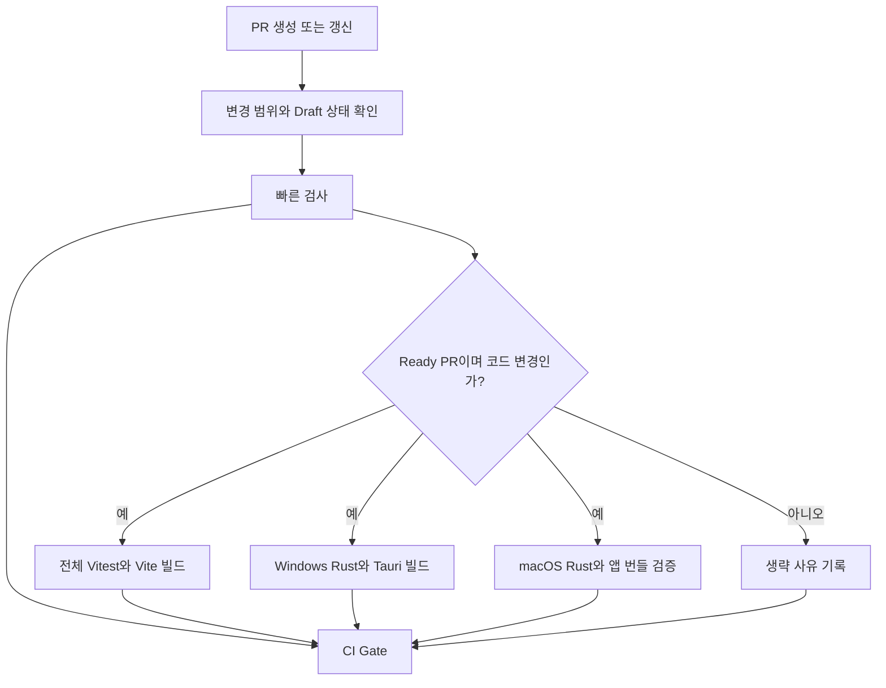

# DmNote CI 도입 제안

> 작성일: 2026-09-05 · 상태: 검토용 제안
>
> 조사 기준: 로컬 `main`의 `198bf32df28755f131bfa5cbb96115949dffde9c`, GitHub 설정·실행 기록, 공식 문서와 프로젝트 워크플로
>
> 초기 제안과 판단 근거를 보존한다. `ci/pr-quality-pipeline` 브랜치에서 PR·main·주간·릴리즈 검증과 ruleset 적용 파일을 구현했다. 현재 운영 방식과 병합 후 설정은 [CI 운영 안내](./ci-operations.md)를 따른다. GitHub ruleset은 아직 활성화하지 않았다.

## 1. 권장 운영 방식

**로컬 커밋과 일반 작업 브랜치 push에는 검증을 강제하지 않고, Draft PR에는 빠른 검사, 리뷰 준비가 된 PR에는 전체 테스트와 Windows·macOS 빌드를 적용한다.** 병합 조건은 고정된 `CI Gate` 하나로 관리한다. 배포·서명, 실제 장치 검사, 시간 기반 성능 측정은 각각 별도 흐름으로 운영한다.

| 시점                     | 권장 검사                                                        | 목적                                                     |
| ------------------------ | ---------------------------------------------------------------- | -------------------------------------------------------- |
| 로컬 commit              | 필수 Git hook 없음                                               | 작은 커밋과 작업 중 저장을 방해하지 않음                 |
| PR 없는 작업 브랜치 push | 자동 CI 없음                                                     | 원격 백업마다 네이티브 빌드하지 않음                     |
| Draft PR 생성·갱신       | 포맷, lint, 타입, 문서·공유 계약 검사                            | 리뷰 요청 전 빠른 오류 확인                              |
| Ready PR 생성·전환·갱신  | 빠른 검사 + 전체 Vitest + Vite 빌드 + Windows·macOS 검증         | 병합 전 회귀와 플랫폼 빌드 오류 차단                     |
| `main` push              | 빠른 검사만                                                      | 병합 결과 확인; 기존 문서 동기화·버전 릴리즈 트리거 병행 |
| 주 1회 및 수동 실행      | 변경 경로와 무관한 전체 검증 + 배포 형식 사전 빌드 + 의존성 점검 | 경로 분류 누락, 도구·외부 의존성 변화 확인               |
| 실제 릴리즈              | 배포할 SHA 검증 + 기존 최적화 빌드·서명·패키징·공증              | 사용자에게 전달할 결과물 검증                            |

**PR CI도 PR에 새 커밋을 push하면 다시 실행된다.** `pull_request.synchronize`를 생략해 무거운 검사를 PR 생성 시 한 번만 실행하면, 이후 변경이 검사되지 않는다. 작업 중에는 Draft 상태를 유지하고, Ready 상태에서는 최신 변경을 다시 검사하는 것이 권장안이다. 같은 PR의 이전 실행은 새 실행이 시작되면 취소한다. [GitHub 이벤트 문서](https://docs.github.com/en/actions/reference/workflows-and-actions/events-that-trigger-workflows), [실행 동시성 제어](https://docs.github.com/en/actions/how-tos/write-workflows/choose-when-workflows-run/control-workflow-concurrency)

Husky나 lint-staged는 초기 도입에서 필수가 아니다. 로컬 자동 포맷이 필요해지면 변경 파일에 한정한 선택적 hook을 추가한다. 전체 타입 검사, 전체 테스트, Cargo 빌드는 커밋 hook에 넣지 않는다.

## 2. 현재 프로젝트에서 확인한 출발점

| 확인 대상                                                                                                                                   | 현재 상태                                                                           | CI에 반영할 사항                                                                 |
| ------------------------------------------------------------------------------------------------------------------------------------------- | ----------------------------------------------------------------------------------- | -------------------------------------------------------------------------------- |
| [Windows ASIO CI](https://github.com/DmNote-App/DmNote/blob/198bf32df28755f131bfa5cbb96115949dffde9c/.github/workflows/ci-windows-asio.yml) | 모든 PR과 수동 실행에서 fmt·check·Clippy·`audio::engine` 테스트                     | 기존 작업을 Windows 전체 검증으로 확장; 중복 workflow 제거                       |
| [package.json](../package.json)                                                                                                             | `type-check`, `lint`, `format:check`, `test`, `build`, `test:docs` 존재             | 기존 명령 재사용                                                                 |
| [Vitest 설정](../vitest.config.ts)                                                                                                          | jsdom에서 `src`와 `tests` 테스트 수집                                               | 프론트 전체 검증을 Linux runner에서 실행 가능하도록 확인                         |
| [Vite 설정](../vite.config.ts)                                                                                                              | React Compiler 사용                                                                 | 일반 Vitest와 별도로 production Vite 빌드 필요                                   |
| [Cargo 설정](../src-tauri/Cargo.toml)                                                                                                       | Windows/macOS 전용 의존성, Windows 선택적 `asio-backend`, `rodio` Git revision 고정 | 지원 플랫폼별 네이티브 검사, ASIO 사용·미사용 구성 구분                          |
| [공유 계약 테스트 예시](../tests/editor-property-wire-parity.test.ts)                                                                       | TS와 Rust가 `tests/fixtures`를 공유                                                 | Rust만 바뀌어도 TS 계약 검사 실행; fixture 변경 시 양쪽 검사                     |
| [문서 검사](../tests/docs-code-blocks.test.ts)                                                                                              | MDX 예제 구문과 일부 공개 API·en/ko 계약 검사                                       | `docs/content` 변경도 검사; 전체 API 문서의 의미적 동기화를 보장하는 검사는 아님 |
| [build.rs](../src-tauri/build.rs)                                                                                                           | permissions 생성, macOS Swift Dock helper 생성                                      | 생성 파일 누락과 helper 생성 실패 확인                                           |
| [macOS 번들 검증](../scripts/verify-macos-bundle.sh)                                                                                        | helper·notices·아키텍처·최소 OS·조건부 서명 검사                                    | PR의 `.app` 생성 후 재사용                                                       |
| [Windows 릴리즈](../.github/workflows/release-windows.yml) / [macOS 릴리즈](../.github/workflows/release-macos.yml)                         | `main`의 버전 커밋 감지와 수동 실행; 최적화 빌드·서명·draft 릴리즈                  | PR CI에서 직접 호출하기에는 권한과 부수 효과가 큼                                |
| [문서 동기화](../.github/workflows/trigger-docs-sync.yml)                                                                                   | `docs/content` 변경을 DmSite로 전달                                                 | 이 저장소에 없는 문서 사이트 빌드 명령을 만들지 않음                             |
| [AI 코드 리뷰](../.github/workflows/claude-code-review.yml)                                                                                 | PR 갱신마다 실행, OAuth secret 사용                                                 | 필수 품질 체크와 분리; Draft·fork 실행 정책 정리                                 |

2026-09-05 GitHub API 조회에서 저장소는 **public**, 기본 브랜치는 `main`이었다. 저장소 ruleset 목록과 `main` 적용 규칙은 빈 배열이었고, 브랜치 보호 조회는 `Branch not protected`였다. 따라서 **CI 실패를 실제 병합 차단으로 연결하는 설정도 도입 범위**에 포함한다. 이는 조사 시점의 상태이며 적용 직전에 다시 확인한다.

최근 성공한 기존 ASIO job의 실측 시간은 다음과 같다. workflow 대기 시간이 아닌 job의 `started_at`부터 `completed_at`까지이며, 새 CI의 예상 시간으로 환산하지 않는다.

| 실행                                                                                 | job 소요 시간 | 관찰                                                                           |
| ------------------------------------------------------------------------------------ | ------------: | ------------------------------------------------------------------------------ |
| [2026-08-31 실행](https://github.com/DmNote-App/DmNote/actions/runs/33347214822)     |      6분 23초 | 기존 ASIO 검사 성공                                                            |
| [2026-09-05 KST 실행](https://github.com/DmNote-App/DmNote/actions/runs/33930837019) |     10분 18초 | check 3분 48초, Clippy 27초, 오디오 테스트 단계 3분 54초, 캐시 후처리 1분 27초 |

오디오 테스트 단계에는 테스트 바이너리 컴파일 시간도 포함된다. 두 표본만으로 캐시 효과나 정상 P95를 판단하지 않는다. 새 프론트 전체 검사와 macOS job 시간은 아직 측정하지 않았다.

추가 로그 검토에서 2026-09-05 실행의 오디오 테스트 자체는 **17개 통과, 0.01초**였고 나머지 1,014개는 이름 필터로 제외되어 있었다. 따라서 3분 54초를 오디오 assertion 실행 비용으로 해석하면 안 된다. 이 표본에서는 테스트 실행보다 컴파일·링크 등 준비 비용이 지배적이다. [해당 실행 로그](https://github.com/DmNote-App/DmNote/actions/runs/33930837019)

기존 [리팩터링 검증 기록](./code-quality-refactoring-plan.md)에는 전체 테스트 통과와 함께 ESLint 경고, React/jsdom stderr, Vite chunk 경고가 기록되어 있다. 초기 CI는 현재 명령의 실패 기준을 유지하고, `--max-warnings=0` 같은 강화는 경고를 검토·정리한 별도 변경으로 도입한다. 과거 통과 기록을 새 runner에서의 통과로 간주하지 않는다.

## 3. 참고한 현대 프로젝트와 적용 판단

2026-09-05에 실제 파일을 확인했다. 특정 저장소의 모든 설정을 모범답안으로 간주하지 않고, DmNote와 맞는 구조를 선택했다.

| 참고 대상                                                                                                                              | 확인한 방식                                                                                | DmNote 적용                                                                   |
| -------------------------------------------------------------------------------------------------------------------------------------- | ------------------------------------------------------------------------------------------ | ----------------------------------------------------------------------------- |
| [Tauri core 테스트](https://github.com/tauri-apps/tauri/blob/a5dc562a0088bc447ed9efbef532da3b4be1ac1c/.github/workflows/test-core.yml) | 플랫폼 matrix, 관련 경로 선택, 중복 실행 취소, `fail-fast: false`                          | Windows와 macOS 검사, 이전 PR 실행 취소, 양쪽 실패를 한 번에 확인             |
| [Tauri 생성 파일 검사](https://github.com/tauri-apps/tauri/blob/dev/.github/workflows/check-generated-files.yml)                       | 생성기를 실행한 뒤 작업 트리 차이 검사                                                     | `build.rs`가 만드는 permissions와 커밋된 파일 비교                            |
| [Tauri 벤치마크](https://github.com/tauri-apps/tauri/blob/dev/.github/workflows/bench.yml)                                             | 일반 테스트와 별도 workflow; 기본 브랜치·수동·벤치 경로 PR에서 실행                        | 기능 검사와 성능 측정을 분리하되, DmNote 초기 성능 측정은 수동으로 시작       |
| [Ruff CI](https://github.com/astral-sh/ruff/blob/ec7e6d82d40377c454f622bd2e65c676c9b47aa7/.github/workflows/ci.yaml)                   | 변경 범위에 따른 작업 선택, 여러 플랫폼 테스트, lock 사용, SHA 고정 action, 캐시 저장 조건 | 변경 범위 분류와 재현성 정책 채택; 대규모 전용 runner·테스트 도구 전환은 보류 |

Tauri의 workflow 수준 `paths` 필터를 DmNote의 필수 체크에 그대로 복사하지는 않는다. workflow 전체가 생략되면 필수 체크가 Pending으로 남을 수 있다. DmNote는 workflow를 항상 시작하고 내부 job 선택과 최종 gate로 결과를 집계한다. [GitHub 필수 체크 문제 해결](https://docs.github.com/en/pull-requests/how-tos/merge-and-close-pull-requests/troubleshooting-required-status-checks)

## 4. PR 검사 구성

초기에는 `ci.yml` 하나에서 작업을 조립한다. 플랫폼별 설정이 달라 Windows와 macOS는 별도 job으로 작성해도 충분하다. 반복 로직은 주간·릴리즈 검증에서 실제 재사용하는 시점에 `workflow_call`로 추출한다.



### 빠른 검사: `quality`

권장 runner는 `ubuntu-24.04`다. 의존성 설치도 시간에 포함해 측정하며, 처음에는 다음 검사를 하나의 job에서 수행한다.

```bash
npm ci --no-audit --no-fund
npm run format:check
npm run lint
npm run type-check
npm test -- ./tests/
cargo fmt --manifest-path src-tauri/Cargo.toml -- --check
```

`npm test -- ./tests/`는 현재 `tests/`의 문서·fixture·설정 계약 테스트를 대상으로 하는 빠른 검사다. 현재 설정에서 `vitest list ./tests/ --filesOnly`로 해당 디렉터리의 8개 파일만 선택되는 것을 확인했다. 단순 문자열 `tests`는 `src/renderer/__tests__`까지 매칭할 수 있으므로 경로를 명확히 지정한다. `src/` 전체 테스트를 대체하지 않는다. `cargo fmt`에는 rustfmt 도구만 필요하며 Linux에서 Tauri를 컴파일하지 않는다.

추가로 [actionlint](https://github.com/rhysd/actionlint)를 고정 버전으로 설치해 workflow 구문·표현식 오류를 검사한다. workflow 파일이 바뀌었을 때뿐 아니라 초기 도입 시 기존 파일도 검사한다. CI에서는 `format:check`와 `cargo fmt --check`를 사용하고 자동 수정·자동 커밋을 수행하지 않는다.

현재 lint와 타입 검사는 주로 `src/`가 범위다. 신규 `scripts/ci/*.ts`는 별도 TypeScript 설정과 lint 범위에 포함한다. 기존 `.js`·`.mjs` 스크립트 전체의 언어 전환이나 `strict` 활성화는 CI 도입과 묶지 않는다.

### 프론트 전체 검사: `frontend`

Ready PR의 코드 변경이면 아래를 실행한다. 의존성은 job마다 `npm ci`로 설치한다.

```bash
npm test
npm run build
```

Vitest는 현재 jsdom 기반이므로 통과가 실제 WKWebView·WebView2 동작을 보증하지 않는다. 별도 `vite.config.ts`에 있는 React Compiler 변환은 production 빌드로 확인한다. `tests/` 계약 검사의 일부 중복 실행은 빠른 오류 확인을 위해 초기에는 허용한다.

`DMN_*_BENCHMARK` 플래그는 설정하지 않는다. 현재 opt-in 성능 테스트의 skip은 의도된 것이지만, 새로운 skip이나 Rust ignored 테스트 증가는 job summary에서 확인할 수 있게 한다. 초기에는 전체 coverage 수치를 수집하는 주간 실행만 두고 임의의 80%·90% 병합 기준은 만들지 않는다.

### Windows 검사: `windows`

기존 ASIO CI의 MSVC·LLVM/`LIBCLANG_PATH` 준비를 재사용한다. runner는 `windows-2025` x64로 시작하고, 구현 시 이미지 도구 목록을 확인해 compiler·SDK·runner 이미지 버전을 로그에 남긴다. OS 계열 label 고정은 이미지 내부 도구까지 불변으로 만드는 것은 아니다. [GitHub runner 목록](https://docs.github.com/en/actions/reference/runners/github-hosted-runners)

ASIO 활성 구성이 배포 기본값이므로 **일반 Windows job이 ASIO를 켠 상태로 검사**한다. ASIO 전용 workflow나 별도 status check는 만들지 않는다.

```bash
cargo clippy --manifest-path src-tauri/Cargo.toml --all-targets --locked --features asio-backend -- -D warnings
cargo test --manifest-path src-tauri/Cargo.toml --all-targets --locked --features asio-backend
npm run tauri:build -- --debug --no-bundle --ci -- --locked
```

현재 오디오 모듈에 한정된 테스트를 전체 Rust 테스트로 확장하고 오디오 테스트도 그 안에서 한 번만 실행한다. 같은 target·feature의 별도 `cargo check` 단계는 Clippy와 테스트·빌드가 있는 CI 구성에서는 생략한다. 마지막 Tauri 명령은 실제 앱 링크와 frontend 포함 빌드를 확인하므로 유지한다. debug 빌드는 PR 피드백을 위한 것이며 실제 release 최적화·Windows `panic=abort` 검증은 주간 사전 빌드와 릴리즈가 담당한다. 이 CI 단계 축소는 `AGENTS.md`의 로컬 작업 마무리 명령을 변경하는 것은 아니다. [Clippy 사용법](https://doc.rust-lang.org/clippy/usage.html), [Cargo 테스트 실행 방식](https://doc.rust-lang.org/cargo/commands/cargo-test.html)

ASIO 미사용 구성은 **초기에는 주간·수동 전체 검증에서 Clippy·전체 테스트·빌드**를 수행한다. 모든 PR에서 두 feature 구성을 중복 실행하지 않는다. 오디오·Cargo 의존성·feature·빌드 설정을 바꾸는 PR은 병합 전 수동 전체 검증 대상으로 삼고, 이후 경로 분류를 세분화할 때 해당 PR의 미사용 구성도 자동으로 추가할 수 있다. 수동 검증이 자동 PR gate에 포함되는 것처럼 표시하지 않는다. macOS에서 ASIO feature를 켜는 것으로 Windows ASIO 검사를 대체할 수 없다.

ASIO SDK 확보 방식과 다운로드 의존성은 첫 Windows pilot에서 로그로 확인하고, 버전·출처와 가능한 checksum을 기록한다. 정책 테스트 통과는 실제 ASIO 장치 출력 성공과 별도로 취급한다. GitHub Windows runner의 성공도 README가 지원하는 Windows 10/11 실기 동작을 모두 증명하지 않는다.

### ASIO 전용 CI의 필요성 재검토

**판단: ASIO를 포함한 Windows 검증과 의미 있는 오디오 테스트는 유지하고, ASIO 전용 실행 단위는 일반 CI로 통합한다.** Windows 컴파일을 대체할 job이 없는 현재 상태에서 기존 workflow만 먼저 삭제하는 것은 권하지 않는다.

| 현재 검사                   | 실제 검증 범위                                                     | 권장 처리                                            |
| --------------------------- | ------------------------------------------------------------------ | ---------------------------------------------------- |
| ASIO feature 컴파일         | Windows 전용 코드, CPAL/rodio 타입 연결, ASIO 의존성·빌드 도구     | 일반 Windows job의 feature 활성화로 유지             |
| 별도 `cargo check`          | 같은 feature의 Clippy와 컴파일 오류 검출이 중복                    | CI에서 별도 단계 생략; 진단용 로컬 명령은 유지       |
| `audio::engine`만 골라 실행 | 드라이버 이름·버퍼·구성·오류·fallback 정책과 일부 시스템 출력 경로 | feature를 켠 전체 Rust 테스트에 포함; 별도 실행 생략 |
| 실제 ASIO 장치 재생         | 현재 테스트는 성공한 ASIO 장치 연결·재생·지연을 검증하지 않음      | 장치·드라이버를 고정한 수동/전용 smoke에서 확인      |
| ASIO 미사용 Windows 구성    | feature를 끈 Windows 분기와 링크                                   | 초기에는 주간·수동 검증; 관련 변경 시 병합 전 확인   |

근거는 다음과 같다.

- [ASIO 구현](../src-tauri/src/audio/engine/asio.rs)의 실제 장치 경로는 `cfg(all(windows, feature = "asio-backend"))`에 들어 있다. macOS 테스트나 feature 없는 Windows 검사만으로는 이 코드가 빌드되는지 알 수 없다. Windows 배포가 ASIO를 포함하는 동안 이 구성을 검사할 이유가 있다.
- 같은 파일의 주입 기반 테스트는 `FakeDevice`와 주입된 open 함수를 사용한다. 이름이 비슷한 다른 드라이버를 선택하지 않는지, 장치 설명 실패를 건너뛰는지, 요청 버퍼와 오류가 보존되는지 확인한다. 실제 ASIO 재생 검사는 아니지만 production이 사용하는 선택 로직의 회귀 검사이므로 전체 삭제할 이유는 약하다.
- 샘플레이트·채널 0을 거부하는 정책, 장치 부재와 일시적 열기 실패를 구분하는 정책은 크래시 방지와 사용자 출력 설정 보존에 관련된다. 이는 [오디오 엔진 테스트](../src-tauri/src/audio/engine/tests.rs)에서 계속 보호할 가치가 있다.
- 반면 `backend_capability_matches_compile_configuration`은 구현과 같은 `cfg!` 표현식을 대조해 독립적인 검증 가치가 낮다. 향후 테스트 정리에서 삭제 후보로 둘 수 있지만, 이 assertion 하나가 CI 시간을 좌우하지는 않는다.
- 일부 일반 출력 테스트는 host 장치를 열려고 시도하고, `startup_forgets_missing_device_and_notifies`는 기본 장치도 열지 못하면 핵심 assertion 전에 반환한다. 따라서 “headless에서도 통과했으니 fallback 전체 검증 완료”로 해석하지 않는다. 정책 검사를 강화할 때는 이 경계에 결과를 주입해 장치 없는 환경에서도 assertion을 실행하도록 보완한다.
- [2026-08-31 실패 실행](https://github.com/DmNote-App/DmNote/actions/runs/33346353309)은 `panel_drag/windows.rs`의 Windows API 경로와 native window 함수 참조 오류를 검출했다. 이는 ASIO 고유 버그의 증거가 아니라 **현재 ASIO job이 사실상 일반 Windows 컴파일 검증 역할도 수행한다는 사례**다.

Cargo의 테스트 이름 필터는 테스트 바이너리에 전달되므로 `audio::engine`만 선택해도 전체 library test target의 컴파일·링크 비용이 사라지는 것은 아니다. 이미 전체 Rust 테스트를 실행할 계획이라면 오디오 assertion을 제외해 얻는 절감보다 독립 job과 재컴파일을 줄이는 편이 합리적이다. [Cargo 테스트 필터 문서](https://doc.rust-lang.org/cargo/commands/cargo-test.html)

또한 기존 실행에서 `cargo check`가 3분 48초, 뒤의 Clippy가 27초였다고 해서 check 삭제로 3분 48초가 절약되는 것은 아니다. 먼저 실행되는 Clippy·test가 기존의 준비 비용을 부담할 수 있다. 같은 cache 조건에서 변경 전후 시간을 측정한 뒤 절감 효과를 판단한다.

전환은 새 Windows job의 ASIO Clippy·전체 테스트·Tauri 빌드 성공을 확인하고 기존 `ci-windows-asio.yml`을 제거하는 순서다. 릴리즈도 **같은 Windows·feature·배포 SHA의 전체 테스트**가 선행할 때만 기존의 오디오 전용 테스트 단계를 제거한다. 릴리즈 빌드 성공만으로 정책 테스트를 대체하지 않는다.

### macOS 검사: `macos`

기존 릴리즈와 같은 `macos-15` arm64를 시작점으로 사용하고, 실제 runner 아키텍처도 로그에 남긴다. PR에서는 host 아키텍처의 앱을 검증하고 Universal 앱은 주간·릴리즈에서 만든다. Intel에서의 실행 검증은 별도 범위다. [GitHub runner 목록](https://docs.github.com/en/actions/reference/runners/github-hosted-runners)

```bash
cargo clippy --manifest-path src-tauri/Cargo.toml --all-targets --locked -- -D warnings
cargo test --manifest-path src-tauri/Cargo.toml --all-targets --locked
npm run tauri:build:no-asio -- --debug --bundles app --no-sign --ci -- --locked
bash scripts/verify-macos-bundle.sh "src-tauri/target/debug/bundle/macos/DM NOTE.app"
```

Swift/Xcode 도구와 helper 생성도 포함한다. `build.rs`의 helper 실패는 경고 후 반환하는 경로가 있어 Cargo 성공만 확인하면 누락을 놓칠 수 있다. `.app` 생성과 기존 검증 스크립트로 helper 두 아키텍처, notices, 최소 macOS 버전을 확인한다. PR에는 Apple 인증서·공증·업데이터 서명 키를 주입하지 않는다. 서명 검증이 생략된 결과를 서명 성공으로 표시하지 않는다.

이 명령의 CLI 옵션은 현재 설치된 `tauri build --help`와 대조했다. 두 OS에서 실제 실행해 생성 경로와 성공 여부를 확인하는 것은 구현 pilot의 완료 조건이다.

### 생성 파일 검사

Windows·macOS Cargo/Tauri 실행 후 다음 파일에 변경이 생기면 실패시킨다.

```bash
git diff --exit-code -- src-tauri/permissions/dmnote-allow-all.json
```

`src-tauri/gen/schemas`에는 플랫폼별 schema가 함께 추적되어 있다. 이 디렉터리를 모든 OS에서 무조건 diff 검사하면 플랫폼 차이까지 실패시킬 수 있으므로, pilot에서 생성 차이를 확인하고 공통/플랫폼별 비교 대상을 확정한다. schema 전체 검사는 후속 강화 항목이며 permissions 검사와 구분해 기록한다.

## 5. 변경 경로와 필수 체크의 안전한 연결

첫 도입은 **문서만 바뀐 PR을 제외한 모든 Ready PR에서 양쪽 OS를 검사**한다. 파일별 영향 추정이나 frontend/backend 세부 생략은 실측 후 최적화한다. React와 Rust 사이 계약이 많고, 최근 대규모 리팩터링 이력도 있어 처음부터 세밀한 필터를 만드는 이득이 불확실하다.

| 변경 범위                                                                                 | 초기 동작                                              |
| ----------------------------------------------------------------------------------------- | ------------------------------------------------------ |
| 모든 변경이 `README.md`, `AGENTS.md`, `docs/**/*.md`, `docs/content/**/*.mdx` 안에만 있음 | `quality` 실행, 무거운 job 생략; 문서 계약 검사는 유지 |
| `src/**`, `src-tauri/**`, `tests/**`, `scripts/**`, 자산·설정·lockfile 변경               | Ready이면 전체 검사                                    |
| `.github/**`, 신규 CI 스크립트, 도구 버전 파일 변경                                       | Ready이면 전체 검사; actionlint 포함                   |
| 문서와 코드가 섞임, 미분류 경로, 삭제·이동을 명확히 분류하지 못함                         | 전체 검사                                              |
| 주간·수동 전체 검증                                                                       | 경로 분류를 적용하지 않음                              |

문서 allowlist는 문서에서 읽는 런타임 자산이나 새 빌드 입력이 추가되면 재검토한다. `docs/` 전체를 일괄 무시하지 않는다. 이후 세분화하더라도 `tests/fixtures/**`, `src/types/**`, `src-tauri` 계약 변경은 TS와 Rust 양쪽 검사를 연결한다.

구현 시 분류기는 base와 head의 전체 PR diff를 사용한다. 마지막 커밋 하나만 비교하지 않는다. Git diff의 NUL 구분 파일 목록을 처리하고 삭제·rename의 이전/이후 경로를 모두 평가한다. fork PR도 읽기 권한과 공개 base fetch만으로 동작하도록 한다. diff 조회 실패·잘림·누락이 있으면 전체 검사로 전환하거나 분류 job을 실패시키며, 문서 전용으로 처리하지 않는다.

필수 체크는 다음 규칙을 따른다.

1. PR workflow에 workflow 수준 `paths`/`paths-ignore` 필터를 두지 않는다.
2. 이벤트는 `opened`, `synchronize`, `reopened`, `ready_for_review`, `converted_to_draft`, `edited`를 처리한다. `edited`는 대상 브랜치 변경 대응용이며 제목·본문만 바뀐 경우에는 추가 실행 여부를 구분할 수 있다.
3. `CI Gate`는 변경 분류·빠른 검사·모든 무거운 job을 `needs`로 참조하고 `if: always()`로 결과를 확인한다.
4. Ready 코드 PR에서 요구된 job은 **모두 `success`여야 한다.** `failure`, `cancelled`, 예상하지 못한 `skipped`, 비어 있는 분류 출력은 성공으로 처리하지 않는다.
5. Draft 또는 문서 전용 PR에서 계획적으로 생략한 job만 허용한다. summary에 모드와 생략 사유를 표시한다. Ready 전환 시 동일 커밋이어도 전체 검증을 새로 실행한다.
6. Draft에는 병합 불가 상태를 유지한다. Draft의 빠른 검사 성공을 Ready의 전체 검사 성공으로 재사용하지 않는다.
7. 동일 PR의 concurrency group에 workflow 이름과 PR 번호를 포함한다. 새 커밋과 Draft 전환으로 이전 무거운 실행을 취소한다.
8. PR 테스트는 기본 checkout의 test merge ref를 사용해 대상 브랜치와의 통합 결과를 검사한다. main·수동·주간·릴리즈는 각각 검증 대상 SHA를 명확히 기록한다.

job 조건에 의한 skip도 GitHub에서는 성공으로 취급될 수 있으므로 gate가 예상 결과를 직접 판단해야 한다. workflow 자체가 취소되어 gate도 취소된 실행은 통과로 취급하지 않는다. [GitHub 필수 체크 동작](https://docs.github.com/en/pull-requests/how-tos/merge-and-close-pull-requests/troubleshooting-required-status-checks)

`main`의 가벼운 push 검사 이름은 `Main Quality`로 분리한다. 수동·주간 전체 검증에도 별도 이름을 사용한다. 가벼운 push 실행이 PR 필수 체크인 `CI Gate`를 대신 충족하지 않게 한다.

## 6. 버전·캐시·실행 비용

**재현성:** npm은 `npm ci`, Cargo는 `--locked`를 사용한다. 실행 중 lockfile 갱신과 `npm audit fix`는 금지한다. Node는 기존 릴리즈와 동일한 **22 LTS로 시작**하고 검증된 patch를 `.node-version` 등 한 곳에 고정한다. Node 24 LTS 전환은 CI와 릴리즈를 함께 검증하는 별도 PR로 진행한다. 조사일에는 Node 22·24가 LTS이고 로컬 Node 25는 EOL이므로 로컬 버전을 CI 기준으로 복사하지 않는다. [Node.js 릴리즈 현황](https://nodejs.org/en/about/previous-releases)

Rust는 `rust-toolchain.toml`에 pilot에서 통과한 단일 버전과 `clippy`, `rustfmt`를 고정한다. 로컬 `1.93.0`은 검증 후보이며 Windows·macOS 결과 확인 후 확정한다. `Cargo.toml`의 `rust-version = "1.88"`은 최소 버전 선언이므로 CI toolchain 고정과 별개다. MSRV 보장을 유지할지는 주간 검증에서 실제 dependency 호환성을 확인해 문서화한다. action SHA를 고정해도 `toolchain: stable`이면 Rust 버전은 계속 바뀐다는 점을 구분한다.

**캐시:** `setup-node`의 npm 다운로드 캐시와 기존 `Swatinem/rust-cache`를 사용한다. `node_modules`, 서명된 앱, 개인 설정·키를 캐시하지 않는다. Rust 캐시는 OS·아키텍처·toolchain·lockfile·feature·profile 조합이 섞이지 않도록 job별 key를 보완한다. 복원 실패 시 정상 설치·빌드로 진행한다. [rust-cache 설정](https://github.com/Swatinem/rust-cache)

초기에는 PR 전용 캐시와 default branch 캐시를 GitHub의 scope 안에서 사용한다. 주간 또는 main 수동 전체 검증으로 공용 기준 캐시를 만든다. release에는 별도 prefix를 사용하고 PR 산출물을 서명 대상으로 재사용하지 않는다. 캐시 저장·복원 시간이 상당할 수 있으므로 적중률뿐 아니라 업로드 시간·크기도 측정한다.

**병렬화:** 빠른 검사 통과 후 프론트·Windows·macOS를 병렬 실행한다. 하나가 실패해도 나머지 플랫폼 결과를 수집한다. CI가 느리면 먼저 설치·컴파일·테스트·캐시 시간을 구분하고, 그 뒤 Vitest shard나 `cargo-nextest` 필요성을 판단한다. 동일 job 안의 Cargo 명령은 순차 실행해 빌드 디렉터리 lock 경쟁을 피한다.

**운영 상한:** workflow job 단위 timeout과 artifact 보관 기간을 지정한다. 최초 pilot에는 기존 Windows의 45분 상한을 참고하고 macOS는 cold build를 수용하는 상한으로 시작한다. 이후 실측에 맞춰 조정한다. 이는 예상 완료 시간이 아니다. 테스트별 timeout이나 무조건 재시도로 실패를 감추는 정책은 추가하지 않는다.

**비용:** 현재 public 저장소에서 standard GitHub-hosted runner의 실행 시간은 무료이므로 macOS 필수 검사를 비용 추정만으로 빼지 않는다. 대형 runner는 별도 과금 대상이고 artifact·cache 보관량도 관리해야 한다. 초기 최적화 목표는 피드백 대기 시간·중복 실행·저장량이다. [GitHub Actions 과금 문서](https://docs.github.com/en/billing/concepts/product-billing/github-actions)

테스트 결과·실패 로그는 짧게 보관하고, 매 PR의 대용량 앱을 기본 업로드하지 않는다. 수동 사전 빌드는 요청한 바이너리만 artifact로 제공한다. 성능 원시 결과에는 SHA·OS·runner·도구 버전을 함께 기록한다.

## 7. 주간 검사, 성능, 실제 WebView

주간 검사는 default branch에서 다음을 실행한다. 초기에는 주 1회로 시작하고 장애 발견 빈도에 따라 늘린다.

- 경로 필터 없는 전체 품질·프론트·Windows·macOS 검증, Rust doctest.
- Windows 배포 profile의 ASIO/미사용 빌드, macOS Universal `.app`와 번들 검증. 비밀키 없는 사전 빌드이며 실제 서명·공증 성공 여부와 구분한다.
- Vitest coverage 보고서. 초기에는 추세를 수집하고, 변경 코드·핵심 도메인 기준을 정한 뒤 병합 기준 도입 여부를 결정한다.
- npm 의존성 검사와 RustSec 기반 Cargo 의존성 검사. 기존 이슈는 담당·근거·해소 계획을 기록하고 경고를 통째로 무시하지 않는다. lockfile PR에서 새로 유입되는 취약점 차단은 기준선 정리 후 추가한다.

Windows 사전 빌드는 기존 `npm run tauri:build -- --no-bundle --ci -- --locked`, macOS는 `npm run tauri:build:mac:universal -- --bundles app --no-sign --ci -- --locked`를 기반으로 한다. macOS에는 두 Rust target을 설치한다. Windows 미사용 구성은 `tauri:build:no-asio`를 사용한다.

**시간 기반 성능 회귀 판정은 초기 PR 필수 조건에서 제외한다.** 기존 [성능 추적표](./interaction-performance-tracker.md)의 동일 환경·실측 원칙을 유지한다. GitHub 공유 runner의 jsdom 실행 시간과 실제 사용자 WebView 프레임 시간을 같은 지표로 취급하지 않는다. render 수나 호출 횟수처럼 결정적인 회귀 검사는 일반 테스트에 유지할 수 있다.

현재 벤치 스크립트 중에는 실행 결과를 추적 문서에 쓰고 포맷까지 수정하는 경로가 있다. 자동 측정 도입 전 결과 출력과 문서 갱신을 분리하고, CI에서는 artifact만 저장하는 모드를 만든다. 첫 운영은 `workflow_dispatch`로 시작한다. 이후 고정된 실측 환경에서 base/head를 같은 조건으로 비교할 수 있을 때 성능 판정 기준을 추가한다.

실제 UI 자동화는 다음 순서로 확장한다.

1. Windows에서 앱 시작, 설정·오버레이 표시, 편집 저장·재시작 복구, OBS 연결을 작은 smoke 시나리오로 구성한다.
2. 공식 `tauri-driver` 경로를 우선 검토한다. Tauri 공식 문서는 desktop WebDriver를 Windows·Linux에 지원하고 macOS WKWebView driver의 부재를 명시하므로, macOS까지 동일 방식으로 자동화된다고 가정하지 않는다. [Tauri WebDriver](https://v2.tauri.app/develop/tests/webdriver/)
3. macOS는 기존 WKWebView 측정 도구와 수동 smoke를 유지하면서 별도 자동화 방식을 평가한다. ASIO 실장치, 접근성 권한, 전역 입력, 혼합 DPI, 오디오·GPU 동작은 실기 검증 항목으로 남긴다.

Linux는 프론트 검사 runner로 사용한다. README의 앱 지원 대상은 Windows·macOS이므로 Linux Tauri 패키징을 이번 CI 도입의 필수 matrix에 추가하지 않는다.

## 8. PR 권한과 기존 자동화 정리

PR 검증은 `pull_request`, `permissions: contents: read`, checkout의 `persist-credentials: false`를 기본으로 한다. 외부 PR 코드 실행에 `pull_request_target`이나 privileged `workflow_run`을 사용하지 않는다. Apple·SignPath·업데이터·DmSite·AI 인증 secret은 PR 품질 job에 전달하지 않는다. 외부 기여자의 첫 실행에 대한 GitHub 승인 대기는 품질 실패와 구분한다.

action은 공식/검토된 저장소의 전체 commit SHA로 고정하고 버전 주석을 남긴다. Dependabot은 `github-actions`, 루트 `npm`, `/src-tauri`의 `cargo`를 주간 갱신하며 생태계별로 PR을 묶는다. SHA 고정과 유지보수 자동화를 같이 도입한다. [GitHub workflow 보안 권장사항](https://docs.github.com/en/actions/reference/security/secure-use)

AI 리뷰는 사람의 코드 리뷰를 돕는 별도 결과로 유지한다. 현재 workflow도 Draft에서는 생략하고, secret을 사용할 수 없는 fork에서 필수 체크 실패를 만들지 않도록 정리한다. AI 판정·API 가용성·OAuth 만료는 `CI Gate`의 통과 조건에 넣지 않는다.

기존 릴리즈 workflow의 `workflow_dispatch(release=false)`도 Windows에서는 SignPath 테스트 서명을, macOS에서는 별도 배포 준비를 포함하므로 PR smoke 용도로 재사용하지 않는다. 코드 실행과 서명·게시 권한의 경계를 유지한다.

## 9. 필수 체크와 릴리즈 연결

CI pilot 성공 후 `main` ruleset을 적용한다.

- PR을 통한 병합을 요구하고 `CI Gate`를 필수 status check로 지정한다. 최근 성공 실행이 존재한 뒤 설정한다.
- 병합 전 대상 브랜치의 최신 변경을 포함한 검증을 요구한다. 초기에는 최신 base 갱신 후 재검증 방식으로 시작한다.
- 강제 push·브랜치 삭제를 제한하고, 긴급 우회는 실제 유지보수 담당자에게만 명시한다.
- 리뷰 승인 인원 강제는 팀 운영 정책과 분리한다. 1인 작업을 고려해 초기에는 CI 통과를 필수로 하고 승인 인원은 자동으로 늘리지 않는다.

동시 PR이 많아져 merge queue가 필요해지면 그때 도입한다. 도입 시 `merge_group` 이벤트에서 경로·Draft 생략 없이 전체 검증하고 같은 `CI Gate`를 보고해야 한다. [GitHub merge queue 필수 체크 안내](https://docs.github.com/en/pull-requests/how-tos/merge-and-close-pull-requests/troubleshooting-required-status-checks)

현재 릴리즈 preflight는 버전과 SHA를 확인한 뒤 원격 태그를 만들 수 있으며, 새 PR CI와 자동으로 의존 관계가 생기지 않는다. 따라서 후속 릴리즈 연동에서는 **읽기 전용 버전·SHA 결정 → 해당 `release_sha`의 공통 품질 검사 → 태그 생성·서명·draft 릴리즈** 순서를 명시한다. 단순히 “최근 main CI가 녹색”인지 확인하지 않는다. PR의 test merge SHA와 실제 배포 SHA도 혼동하지 않는다.

Windows·macOS 공통 품질 검사는 같은 `release_sha`를 입력받는 재사용 workflow로 공유할 수 있다. 기존 버전 커밋 감지, 수동 릴리즈, draft 릴리즈를 사람이 publish하는 흐름은 유지한다. ruleset 도입 후 버전 변경 PR의 최종 커밋 제목과 기존 `npm version` 감지 조건이 호환되는지도 검증한다.

## 10. 도입 순서와 완료 조건

아래는 구현 PR을 나누는 권장 순서다. 계획 검토 시에는 **PR 1~3을 초기 필수 도입 범위**, PR 4를 정기 운영·릴리즈 연결, PR 5를 확장으로 보는 것이 적절하다.

| 구현 PR                  | 변경                                                                                                                  | 완료 기준                                                                              |
| ------------------------ | --------------------------------------------------------------------------------------------------------------------- | -------------------------------------------------------------------------------------- |
| 1. 실행 기준 고정        | Node·Rust 버전 파일, 기존 명령 점검, CI TS 스크립트 검사 범위, actionlint 기준선                                      | cold runner에서 명령 실행 가능; 기존 경고·skip과 실제 실패 구분                        |
| 2. PR 품질 검사 통합     | `ci.yml`, Draft/Ready 정책, 보수적 문서 분류, 프론트 전체 검사, ASIO를 켠 Windows 전체 검사, macOS 앱 검증, `CI Gate` | 두 플랫폼에서 성공; 기존 ASIO workflow와 중복 실행 제거; 아래 상태 전이 실험 통과      |
| 3. 병합 조건·의존성 관리 | `main` ruleset, SHA pin, Dependabot, AI 리뷰 조건, `Main Quality`                                                     | 실패 PR 차단; fork·문서 PR 정상 처리; 가벼운 검사로 gate 우회 불가                     |
| 4. 정기 검증·릴리즈 연동 | 주간/수동 전체 검사, coverage·취약점 기준선, 배포 형식 사전 빌드, `release_sha` 검증 연결                             | public runner 결과와 소요 시간 기록; 잘못된 SHA나 실패 결과로 태그·서명 단계 진행 불가 |
| 5. 실측 후 확장          | Windows WebView smoke, 성능 artifact 모드, 필요 시 경로 세분화·shard·nextest                                          | 측정 가능한 병목·누락을 해결하고 기존 필수 검사 범위 유지                              |

PR 2의 분류·gate는 조건 조합이 병합 허용 여부를 결정하므로 작은 TS 단위 테스트와 실제 테스트 PR로 검증한다. 일반 UI 변경에 구현을 그대로 복제하는 테스트를 추가하는 것과는 목적이 다르다.

| 검증 시나리오                             | 기대 결과                                            |
| ----------------------------------------- | ---------------------------------------------------- |
| Draft 생성·여러 번 push                   | 빠른 검사만 실행, 네이티브 job 생략                  |
| 같은 SHA로 Ready 전환                     | 전체 job 새 실행                                     |
| Ready PR에 새 커밋 push                   | 이전 실행 취소, 최신 변경 전체 검사                  |
| Ready → Draft                             | 진행 중 무거운 실행 취소, Draft 모드 표시            |
| 문서 전용 PR                              | 문서·계약 검사 완료 후 gate 성공, Pending 잔류 없음  |
| Rust만 변경 / 공유 fixture만 변경         | TS 계약 검사와 양쪽 네이티브 검사 실행               |
| 새 경로·삭제·rename·diff 조회 실패        | 보수적 전체 검사 또는 명시적 실패                    |
| lint·Vitest·Windows·macOS 중 하나 실패    | `CI Gate` 실패, 병합 차단                            |
| 필수 job 취소 또는 예상하지 못한 skip     | gate 성공 불가                                       |
| fork PR                                   | secret 없이 품질 검증 가능; AI 실행 가능 여부와 무관 |
| base 브랜치 변경·최신 base 반영           | 새 통합 결과 검증, 이전 성공으로 병합 불가           |
| main 빠른 검사·수동 검사만 성공           | PR 필수 체크를 대신 충족하지 않음                    |
| 캐시 없는 실행과 캐시 있는 실행           | 모두 동일한 검사 결과; 시간 차이는 실측으로만 기록   |
| permissions 생성 차이 / macOS helper 누락 | 명시적 실패                                          |
| 버전 PR과 수동 릴리즈 사전 검증 실패      | 태그·서명·draft 릴리즈 단계에 진입하지 않음          |

운영 첫 2주 동안 PR별 전체 완료 시간, job별 설치·빌드·테스트·캐시 시간, 실패 원인, 재실행률, skip/ignored 수, artifact 크기를 기록한다. 표본과 runner 구성을 함께 남기고 충분한 표본이 모이면 중앙값·P95를 계산한다. 그 결과를 근거로 검사 분리와 주기를 조정하며, 아직 측정하지 않은 “몇 분 이내” 수치를 성능 사실처럼 약속하지 않는다.
