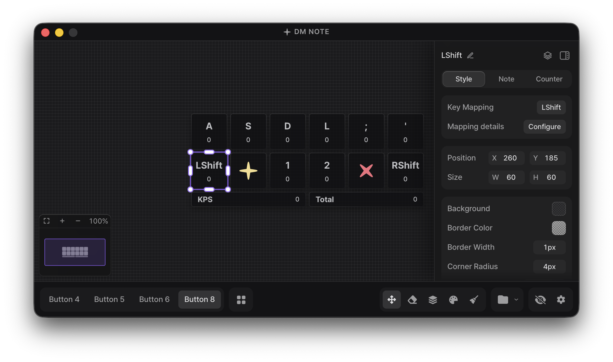

[한국어](../README.md) | **English** | [中文](readme_zh-cn.md)

<div align="center">
  

  <h1>DM Note</h1>
  
  <p>
    <strong>Make it yours</strong>
  </p>
  <p>
    <strong>A customizable key viewer for DJMAX RESPECT V and any game</strong>
  </p>
  
  [](https://github.com/DmNote-App/DmNote/releases)
  [](https://github.com/DmNote-App/DmNote/releases/download/2.0.2/DM.NOTE.v.2.0.2.zip)
  [](https://github.com/DmNote-App/DmNote/blob/main/LICENSE)
</div>

<div align="center">
  
</div>

## Overview

**DM Note** is a key viewer built for DJMAX RESPECT V.

It works just as well with any other game, and the setup is simple enough to put your key input on a stream or a gameplay video right away.

**Supported** · Windows 10/11 · macOS
On Linux, try the [community fork](https://github.com/northernorca/DmNote).

[Download DM NOTE v2.0.2](https://github.com/DmNote-App/DmNote/releases/download/2.0.2/DM.NOTE.v.2.0.2.zip)

[Code signing policy](../CODE_SIGNING_POLICY.md)

## Features

**Input and display**: [live visualization](https://dmnote.app/en/docs/guide/interface) · [key mapping](https://dmnote.app/en/docs/guide/key-mapping) · [note effects](https://dmnote.app/en/docs/guide/note-effects) · [key counter](https://dmnote.app/en/docs/guide/key-counter) · KPS stats and graph · key sounds

**Styling**: grid editing · per-key images · [custom CSS](https://dmnote.app/en/docs/custom-css) · plugins · [presets](https://dmnote.app/en/docs/guide/presets)

**Overlay**: always on top · lock position · resize anchor · OBS browser source

Five interface languages, shortcuts, settings reset, and auto-update round it out. See the [documentation](https://dmnote.app/en/docs/) for the details.

## Installation

Grab the latest build from the download link above, unzip it, and run it.

macOS needs a few permissions first. Check the [macOS installation and permission guide](https://github.com/DmNote-App/DmNote/blob/main/docs/mac_guide_en.md).

Settings live in the `%appdata%/com.dmnote.desktop` folder.

> Free to use for streaming and gameplay video production.

## Tips

> [!TIP]
> If you never look at the overlay yourself and only stream or record, use **OBS Mode**.
>
> It puts less load on game frame rates than the regular overlay.

With a separate gaming PC and streaming PC, run DM Note on the gaming PC and connect from the streaming PC through an OBS browser source.

That all but removes the frame drops the key viewer causes.

### When the overlay hides behind the game

**Always on top** still loses to full-screen mode in some games. Switch that game to borderless window mode.

## Plugins and CSS

> [!WARNING]
> **Never load a plugin you do not trust.**
>
> Before running an unofficial plugin, check it with a tool like ChatGPT.

Custom CSS reshapes the interface and the overlay however you want.

Official plugins and CSS samples ship inside `assets.zip`.

Enter class names without the selector (`blue` ✅, `.blue` ❌).

## Development

### Tech stack

- **Frontend**: React 19 + TypeScript + Vite 7
- **Backend**: Tauri
- **Styling**: Tailwind CSS 3
- **Input detection**: Raw Input API (Windows), global input events (macOS)
- **Package manager**: npm

### Install and run

Run these in your terminal, in order.

```bash
git clone https://github.com/DmNote-App/DmNote.git
cd DmNote
npm install
npm run tauri:dev
```

<details>
<summary><b>Windows ASIO build</b></summary>

On Windows, `npm run tauri:dev` / `npm run tauri:build` include ASIO key sound output by default (the npm scripts enable the `asio-backend` feature).

An ASIO build needs two things beyond the regular dependencies.

- **LLVM/Clang**: used by bindgen to generate ASIO header bindings. Install LLVM (`winget install LLVM.LLVM` or `scoop install llvm`) and point `LIBCLANG_PATH` at LLVM's `bin` folder.
- **ASIO SDK**: the Steinberg ASIO SDK is vendored here (`src-tauri/vendor/asio-sdk`) and picked up automatically. No extra setup or network access is required, and `CPAL_ASIO_DIR` overrides it with your own SDK.

To build without ASIO (no LLVM needed, handy when contributing) use `npm run tauri:dev:no-asio` / `npm run tauri:build:no-asio`. Plain `cargo check` / `cargo build` in `src-tauri` also leave ASIO out; add `--features asio-backend` to cover those code paths.

> This repository uses the Steinberg ASIO SDK under the GPLv3 option of its dual license. See [THIRD_PARTY_NOTICES.txt](../THIRD_PARTY_NOTICES.txt). _ASIO is a trademark of Steinberg Media Technologies GmbH, registered in Europe and other countries._

</details>

## Contributing

Contributions are always welcome. See the [contributing guide](../CONTRIBUTING.md) for details.

### Contributors

<!-- ALL-CONTRIBUTORS-LIST:START - Do not remove or modify this section -->
<!-- prettier-ignore-start -->
<!-- markdownlint-disable -->
<table>
  <tbody>
    <tr>
      <td align="center" valign="top" width="14.28%"><a href="https://github.com/lee-sihun"><br /><sub><b>이시훈</b></sub></a><br /><a href="#maintenance-lee-sihun" title="Maintenance">🚧</a> <a href="https://github.com/DmNote-App/DmNote/commits?author=lee-sihun" title="Code">💻</a> <a href="#ideas-lee-sihun" title="Ideas, Planning, & Feedback">🤔</a></td>
      <td align="center" valign="top" width="14.28%"><a href="https://github.com/eun-yeon"><br /><sub><b>연우</b></sub></a><br /><a href="#maintenance-eun-yeon" title="Maintenance">🚧</a> <a href="#design-eun-yeon" title="Design">🎨</a> <a href="#ideas-eun-yeon" title="Ideas, Planning, & Feedback">🤔</a></td>
      <td align="center" valign="top" width="14.28%"><a href="https://github.com/mohong2"><br /><sub><b>mo_hong</b></sub></a><br /><a href="#translation-mohong2" title="Translation">🌍</a></td>
      <td align="center" valign="top" width="14.28%"><a href="https://github.com/LSVoiid"><br /><sub><b>LSVoiid</b></sub></a><br /><a href="#translation-LSVoiid" title="Translation">🌍</a> <a href="https://github.com/DmNote-App/DmNote/commits?author=LSVoiid" title="Documentation">📖</a></td>
      <td align="center" valign="top" width="14.28%"><a href="https://github.com/kahyou22"><br /><sub><b>문주</b></sub></a><br /><a href="https://github.com/DmNote-App/DmNote/commits?author=kahyou22" title="Code">💻</a></td>
      <td align="center" valign="top" width="14.28%"><a href="https://github.com/dustingusius"><br /><sub><b>dustingusius</b></sub></a><br /><a href="#translation-dustingusius" title="Translation">🌍</a></td>
      <td align="center" valign="top" width="14.28%"><a href="https://github.com/dotoritos-kim"><br /><sub><b>Dotoritos</b></sub></a><br /><a href="https://github.com/DmNote-App/DmNote/commits?author=dotoritos-kim" title="Code">💻</a></td>
    </tr>
    <tr>
      <td align="center" valign="top" width="14.28%"><a href="https://github.com/KGH1113"><br /><sub><b>KGH1113</b></sub></a><br /><a href="https://github.com/DmNote-App/DmNote/commits?author=KGH1113" title="Code">💻</a></td>
    </tr>
  </tbody>
</table>

<!-- markdownlint-restore -->
<!-- prettier-ignore-end -->

<!-- ALL-CONTRIBUTORS-LIST:END -->

## License

[GPL-3.0 License Copyright (C) 2024 DM NOTE](https://github.com/DmNote-App/DmNote/blob/main/LICENSE)

## Special Thanks

- [tauri-apps/tauri](https://github.com/tauri-apps/tauri)
