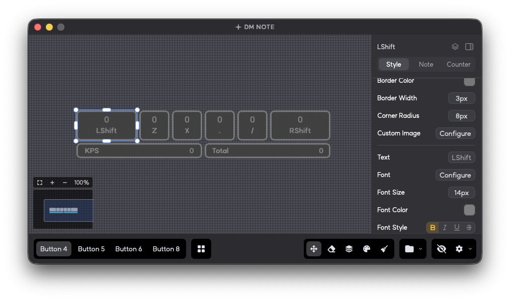

[한국어](../README.md) | [English](readme_en.md) | **中文**

<div align="center">
  

  <h1>DM Note</h1>
  
  <p>
    <strong>支持广泛自定义的按键显示程序</strong>
  </p>
  <p>
    <strong>提供用户自定义按键映射与样式、可轻松切换的预设，以及现代化、直观的界面</strong>
  </p>
  
  [](https://github.com/lee-sihun/DmNote/releases)
  [](https://github.com/lee-sihun/DmNote/releases/download/1.6.0/DM.NOTE.v.1.6.0.zip)
  [](https://github.com/lee-sihun/DmNote/blob/master/LICENSE)
</div>

https://github.com/user-attachments/assets/d2d638b4-5867-4a3e-8710-0fa843eaf236

## 🌟 概述

**DM Note** 是一款专为 DJMAX RESPECT V 优化的按键显示程序，也可以自由用于其他游戏。通过简单设置，您可以在直播或游戏视频创作时可视化显示按键输入。目前仅官方支持 Windows 10/11 和 macOS 环境。如果您使用的是 Linux，我们推荐尝试 [社区分支版本](https://github.com/northernorca/DmNote)。

[前往下载 DM NOTE v1.6.0](https://github.com/lee-sihun/DmNote/releases/download/1.6.0/DM.NOTE.v.1.6.0.zip)

## 🖼️ 截图




## ✨ 功能特性

### ⌨️ 键盘输入 与 映射

- 实时键盘输入检测与可视化
- 自定义按键映射配置

### 🎨 按键样式 自定义

- 基于网格的按键编辑
- 支持图片分配

### 🌧️ 音符键雨自定义

- 音符键雨样式自定义
- 轨道速度、高度及反转模式支持

### 🔢 按键计数器

- 显示每个按键的输入次数
- 自定义计数器位置、颜色和样式

### 📊 输入统计

- KPS、AVG、MAX、TOTAL 统计显示
- KPS 图表可视化
- 统计元素及图表样式自定义

### 🎵 按键音效

- 按键输入时播放音效
- 支持自定义音效文件

### 🖼️ 覆盖层 与 窗口管理

- 锁定窗口位置 & 始终置顶
- 选择调整锚点大小

### 🖥️ OBS 模式

- 兼容 OBS 浏览器源

### 🧩 自定义 CSS 与插件支持

- 通过自定义 CSS 完全自定义程序界面和覆盖层样式
- 支持自定义插件

### 💾 预设 与 设置管理

- 自动保存用户设置
- 保存/加载预设

### ⚙️ 其他设置

- 多语言界面支持（韩文、英文、中文简体/繁体、俄语）
- 快捷键设置支持
- 重置设置及自动更新

## 🚀 开发

### 技术结构

- **前端**: React 19 + Typescript + Vite 7
- **后端**: Tauri
- **样式**: Tailwind CSS 3
- **输入检测**: Raw Input API (Windows), 全局输入事件 (macOS)
- **包管理器**: npm

### 基本安装 与 运行

在终端中按顺序输入一下命令:

```bash
git clone https://github.com/lee-sihun/DmNote.git
cd DmNote
npm install
npm run tauri:dev
```

## � 注意事项

- **本程序可自由用于直播或游戏视频制作等场景。**
- [macOS 安装与权限设置指南](https://github.com/DmNote-App/DmNote/blob/master/docs/mac_guide_zh-cn.md)
- 程序默认设置保存在 `%appdata%/com.dmnote.desktop` 文件夹中。
- 如果您不需要实时查看覆盖层，且用于直播或游戏视频制作，默认推荐使用 **OBS 模式**。这可以减少对游戏帧率的负面影响。
- 如果游戏电脑和直播/录制电脑是分开的，建议在游戏电脑上运行 DM Note，在直播/录制电脑上通过 OBS 浏览器源连接。这样可以几乎完全解决因按键显示器导致的游戏帧率下降问题。
- 即使启用了 **始终置顶** 功能，部分游戏的全屏模式下覆盖层可能会被游戏遮挡。此时请使用无边框窗口模式。
- 官方插件和 CSS 示例文件包含在 `assets.zip` 文件中。
- **请勿加载不受信任的插件。** 使用非官方插件时，请使用 ChatGPT 等工具确认其安全性后再使用。
- 分配类名时，只输入名称，不输入选择器（`blue` ✅，`.blue` ❌）

## 🤝 贡献指南

我们欢迎各位的贡献！详情请查阅 [贡献指南](../CONTRIBUTING.md)

### ✨ 贡献者

<!-- ALL-CONTRIBUTORS-LIST:START - Do not remove or modify this section -->
<!-- prettier-ignore-start -->
<!-- markdownlint-disable -->
<table>
  <tbody>
    <tr>
      <td align="center" valign="top" width="14.28%"><a href="https://github.com/lee-sihun"><br /><sub><b>이시훈</b></sub></a><br /><a href="#maintenance-lee-sihun" title="Maintenance">🚧</a></td>
      <td align="center" valign="top" width="14.28%"><a href="https://github.com/eun-yeon"><br /><sub><b>연우</b></sub></a><br /><a href="#design-eun-yeon" title="Design">🎨</a> <a href="#ideas-eun-yeon" title="Ideas, Planning, & Feedback">🤔</a></td>
      <td align="center" valign="top" width="14.28%"><a href="https://github.com/mohong2"><br /><sub><b>mo_hong</b></sub></a><br /><a href="#translation-mohong2" title="Translation">🌍</a></td>
      <td align="center" valign="top" width="14.28%"><a href="https://github.com/LSVoiid"><br /><sub><b>LSVoiid</b></sub></a><br /><a href="#translation-LSVoiid" title="Translation">🌍</a> <a href="https://github.com/DmNote-App/DmNote/commits?author=LSVoiid" title="Documentation">📖</a></td>
      <td align="center" valign="top" width="14.28%"><a href="https://github.com/kahyou22"><br /><sub><b>문주</b></sub></a><br /><a href="https://github.com/DmNote-App/DmNote/commits?author=kahyou22" title="Code">💻</a></td>
      <td align="center" valign="top" width="14.28%"><a href="https://github.com/dustingusius"><br /><sub><b>dustingusius</b></sub></a><br /><a href="#translation-dustingusius" title="Translation">🌍</a></td>
      <td align="center" valign="top" width="14.28%"><a href="https://github.com/dotoritos-kim"><br /><sub><b>Dotoritos</b></sub></a><br /><a href="https://github.com/DmNote-App/DmNote/commits?author=dotoritos-kim" title="Code">💻</a></td>
    </tr>
    <tr>
      <td align="center" valign="top" width="14.28%"><a href="https://github.com/KGH1113"><br /><sub><b>KGH1113</b></sub></a><br /><a href="https://github.com/DmNote-App/DmNote/commits?author=KGH1113" title="Code">💻</a></td>
    </tr>
  </tbody>
</table>

<!-- markdownlint-restore -->
<!-- prettier-ignore-end -->

<!-- ALL-CONTRIBUTORS-LIST:END -->

## 📄 许可证

[GPL-3.0 License Copyright (C) 2024 lee-sihun](https://github.com/lee-sihun/DmNote/blob/master/LICENSE)

## ❤️ 特别致谢!

- [tauri-apps/tauri](https://github.com/tauri-apps/tauri)
