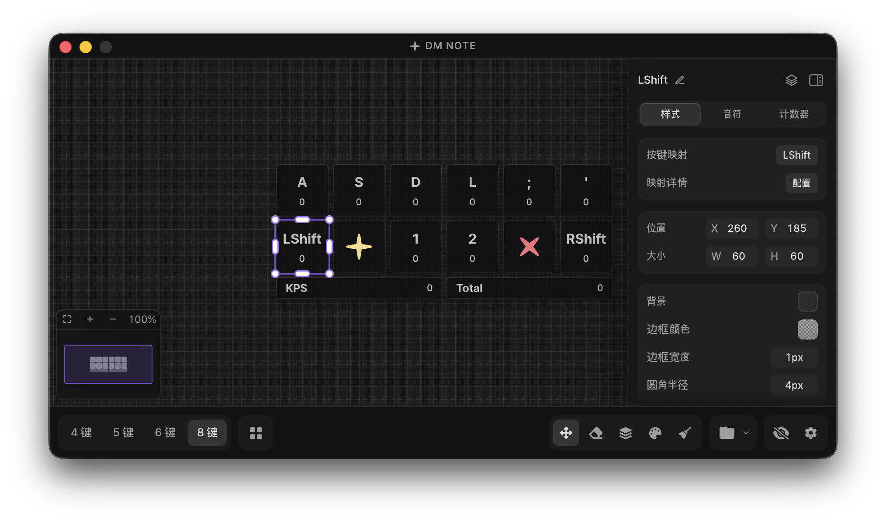

[한국어](../README.md) | [English](readme_en.md) | **中文**

<div align="center">
  

  <h1>DM Note</h1>
  
  <p>
    <strong>Make it yours</strong>
  </p>
  <p>
    <strong>打造专属于你的按键显示程序</strong>
  </p>
  
  [](https://github.com/DmNote-App/DmNote/releases)
  [](https://github.com/DmNote-App/DmNote/releases/download/2.0.0/DM.NOTE.v.2.0.0.zip)
  [](https://github.com/DmNote-App/DmNote/blob/main/LICENSE)
</div>

<div align="center">
  
</div>

## 概述

**DM Note** 是一款专为 DJMAX RESPECT V 打造的按键显示程序。

它同样可以自由用于其他游戏，设置也很简单，可以直接把按键输入显示在直播或游戏视频中。

**支持环境** · Windows 10/11 · macOS
如果您使用 Linux，推荐尝试 [社区分支版本](https://github.com/northernorca/DmNote)。

[前往下载 DM NOTE v2.0.0](https://github.com/DmNote-App/DmNote/releases/download/2.0.0/DM.NOTE.v.2.0.0.zip)

[Code signing policy](../CODE_SIGNING_POLICY.md)

## 功能特性

**输入与显示**：[实时可视化](https://dmnote.app/en/docs/guide/interface) · [按键映射](https://dmnote.app/en/docs/guide/key-mapping) · [音符效果](https://dmnote.app/en/docs/guide/note-effects) · [按键计数器](https://dmnote.app/en/docs/guide/key-counter) · KPS 统计与图表 · 键音

**外观定制**：网格编辑 · 为每个键指定图片 · [自定义 CSS](https://dmnote.app/en/docs/custom-css) · 插件 · [预设](https://dmnote.app/en/docs/guide/presets)

**覆盖层**：始终置顶 · 锁定位置 · 缩放锚点 · OBS 浏览器源

此外还支持 5 种界面语言、快捷键、重置设置和自动更新。详细用法请查阅[文档](https://dmnote.app/en/docs/)。

## 安装

通过上方下载链接获取最新版本，解压后即可运行。

<!-- macOS 需要先设置权限，请先查阅 [macOS 安装与权限设置指南](https://github.com/DmNote-App/DmNote/blob/main/docs/mac_guide_zh-cn.md)。 -->

设置保存在 `%appdata%/com.dmnote.desktop` 文件夹中。

> 本程序可自由用于直播或游戏视频制作。

## 使用技巧

> [!TIP]
> 如果您不需要实时查看覆盖层，只用于直播或录制，推荐使用 **OBS 模式**。
>
> 相比普通覆盖层模式，它对游戏帧率的影响更小。

如果游戏电脑和直播、录制电脑是分开的，建议在游戏电脑上运行 DM Note，再从直播电脑通过 OBS 浏览器源连接。

这样几乎可以完全消除按键显示程序造成的掉帧。

### 覆盖层被游戏遮挡时

即使开启**始终置顶**，部分游戏在全屏模式下仍会遮挡覆盖层。此时请将该游戏切换为无边框窗口模式。

## 插件与 CSS

> [!WARNING]
> **请勿加载不受信任的插件。**
>
> 使用非官方插件前，请用 ChatGPT 等工具确认其安全性。

自定义 CSS 可以随心改变程序界面和覆盖层的样式。

官方插件和 CSS 示例包含在 `assets.zip` 中。

填写类名时只输入名称，不要带选择器（`blue` ✅，`.blue` ❌）。

## 开发

### 技术结构

- **前端**：React 19 + TypeScript + Vite 7
- **后端**：Tauri
- **样式**：Tailwind CSS 3
- **输入检测**：Raw Input API (Windows)、全局输入事件 (macOS)
- **包管理器**：npm

### 安装与运行

在终端中按顺序输入以下命令。

```bash
git clone https://github.com/DmNote-App/DmNote.git
cd DmNote
npm install
npm run tauri:dev
```

<details>
<summary><b>Windows ASIO 构建</b></summary>

在 Windows 上，`npm run tauri:dev` / `npm run tauri:build` 默认包含键音 ASIO 输出（npm 脚本会启用 `asio-backend` 特性）。

包含 ASIO 的构建除常规依赖外还需要以下两项。

- **LLVM/Clang**：供 bindgen 生成 ASIO 头文件绑定。安装 LLVM（`winget install LLVM.LLVM` 或 `scoop install llvm`），并将环境变量 `LIBCLANG_PATH` 设置为 LLVM 的 `bin` 文件夹路径。
- **ASIO SDK**：Steinberg ASIO SDK 已内置在仓库中（`src-tauri/vendor/asio-sdk`）并自动使用。无需额外设置或网络连接，如需使用自己的 SDK，可通过环境变量 `CPAL_ASIO_DIR` 覆盖。

如需不含 ASIO 的构建（无需 LLVM，便于参与贡献），请使用 `npm run tauri:dev:no-asio` / `npm run tauri:build:no-asio`。在 `src-tauri` 中直接运行的 `cargo check` / `cargo build` 默认也不包含 ASIO，如需检查 ASIO 代码路径请加上 `--features asio-backend`。

> 本仓库依据 Steinberg ASIO SDK 双重许可中的 GPLv3 选项使用该 SDK。详见 [THIRD_PARTY_NOTICES.txt](../THIRD_PARTY_NOTICES.txt)。_ASIO is a trademark of Steinberg Media Technologies GmbH, registered in Europe and other countries._

</details>

## 贡献指南

欢迎各位参与贡献。详情请查阅 [贡献指南](../CONTRIBUTING.md)。

### 贡献者

<!-- ALL-CONTRIBUTORS-LIST:START - Do not remove or modify this section -->
<!-- prettier-ignore-start -->
<!-- markdownlint-disable -->
<table>
  <tbody>
    <tr>
      <td align="center" valign="top" width="14.28%"><a href="https://github.com/lee-sihun"><br /><sub><b>이시훈</b></sub></a><br /><a href="#maintenance-lee-sihun" title="Maintenance">🚧</a> <a href="https://github.com/DmNote-App/DmNote/commits?author=lee-sihun" title="Code">💻</a> <a href="#ideas-lee-sihun" title="Ideas, Planning, & Feedback">🤔</a></td>
      <td align="center" valign="top" width="14.28%"><a href="https://github.com/eun-yeon"><br /><sub><b>연우</b></sub></a><br /><a href="#maintenance-eun-yeon" title="Maintenance">🚧</a> <a href="#design-eun-yeon" title="Design">🎨</a> <a href="#ideas-eun-yeon" title="Ideas, Planning, & Feedback">🤔</a></td>
      <td align="center" valign="top" width="14.28%"><a href="https://github.com/mohong2"><br /><sub><b>mo_hong</b></sub></a><br /><a href="#translation-mohong2" title="Translation">🌍</a></td>
      <td align="center" valign="top" width="14.28%"><a href="https://github.com/LSVoiid"><br /><sub><b>LSVoiid</b></sub></a><br /><a href="#translation-LSVoiid" title="Translation">🌍</a> <a href="https://github.com/DmNote-App/DmNote/commits?author=LSVoiid" title="Documentation">📖</a></td>
      <td align="center" valign="top" width="14.28%"><a href="https://github.com/kahyou22"><br /><sub><b>문주</b></sub></a><br /><a href="https://github.com/DmNote-App/DmNote/commits?author=kahyou22" title="Code">💻</a></td>
      <td align="center" valign="top" width="14.28%"><a href="https://github.com/dustingusius"><br /><sub><b>dustingusius</b></sub></a><br /><a href="#translation-dustingusius" title="Translation">🌍</a></td>
      <td align="center" valign="top" width="14.28%"><a href="https://github.com/dotoritos-kim"><br /><sub><b>Dotoritos</b></sub></a><br /><a href="https://github.com/DmNote-App/DmNote/commits?author=dotoritos-kim" title="Code">💻</a></td>
    </tr>
    <tr>
      <td align="center" valign="top" width="14.28%"><a href="https://github.com/KGH1113"><br /><sub><b>KGH1113</b></sub></a><br /><a href="https://github.com/DmNote-App/DmNote/commits?author=KGH1113" title="Code">💻</a></td>
    </tr>
  </tbody>
</table>

<!-- markdownlint-restore -->
<!-- prettier-ignore-end -->

<!-- ALL-CONTRIBUTORS-LIST:END -->

## 许可证

[GPL-3.0 License Copyright (C) 2024 DM NOTE](https://github.com/DmNote-App/DmNote/blob/main/LICENSE)

## 特别致谢

- [tauri-apps/tauri](https://github.com/tauri-apps/tauri)
